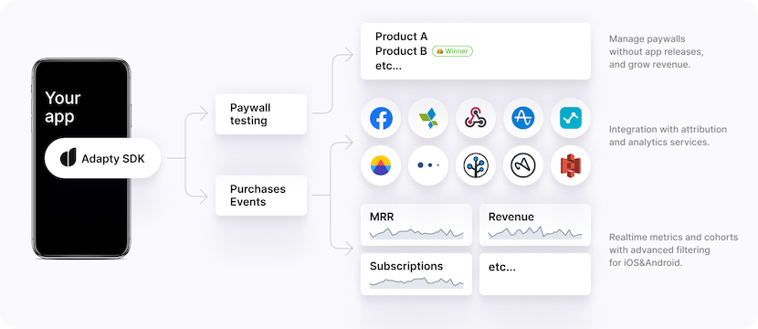

| 序号  | 项目地址                                        | 平台  | 类别               | 项目简介                                                                                                                                                       | 效果图                                        | 备注  |
| --- | ------------------------------------------- | --- | ---------------- | ---------------------------------------------------------------------------------------------------------------------------------------------------------- | ------------------------------------------ | --- |
| 1   | https://github.com/adaptyteam/AdaptySDK-iOS | iOS | In-App Purchases | Adapty SDK is an open-source framework that makes implementing in-app subscriptions for iOS fast and easy. It’s 100% open-source, native, and lightweight. |  |     |
| 2   |                                             |     |                  |                                                                                                                                                            |                                            |     |
| 3   |                                             |     |                  |                                                                                                                                                            |                                            |     |
